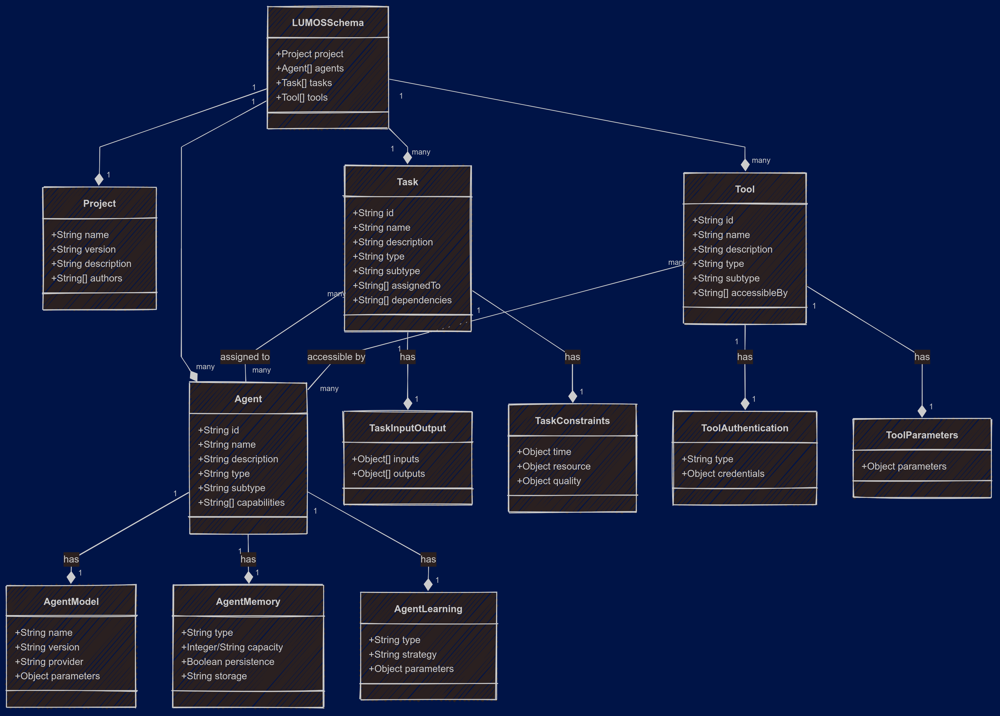
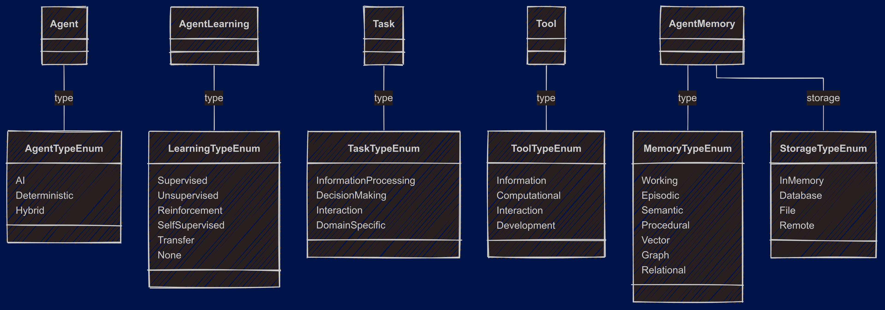
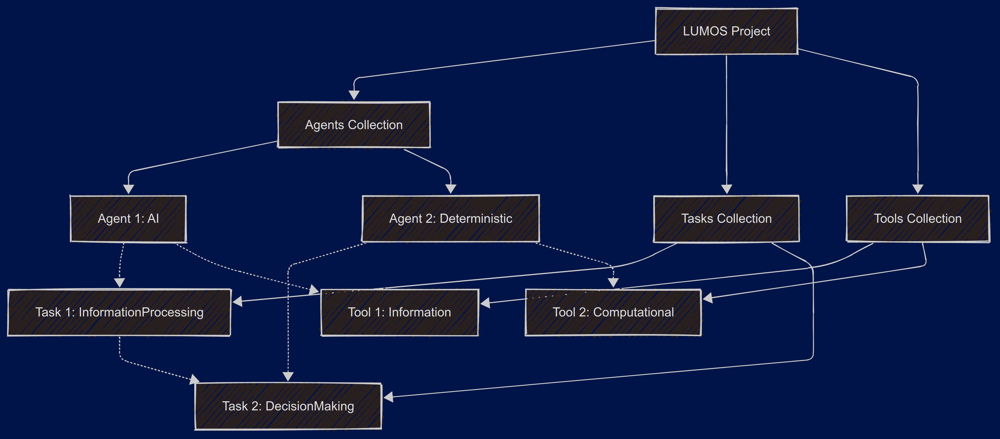

# LDL: LUMOS Defination Language
a JSON based language for defining the structure of a LUMOS project.

## Introduction

LDL (LUMOS Definition Language) is a JSON-based language for defining multi-agent systems. It provides a structured way to describe agents, tasks, tools, environments, and their interactions.

## Schema Overview
The LDL schema consists of several key components that work together to define a complete multi-agent system:

### Core Components

- **Project**: The top-level container for project metadata
    - Contains basic information like name, version, description, and authors
    - Required in all LDL definitions

- **Agents**: The autonomous entities in the system
    - Each agent has an ID, type, and capabilities
    - Types include AI, Deterministic, and Hybrid
    - May include model specifications, memory configurations, and learning parameters
    - Memory can be of various types: Working, Episodic, Semantic, Procedural, Vector, Graph, or Relational

- **Tasks**: Work units assigned to agents
    - Defined with ID, type, and description
    - Can specify inputs, outputs, and constraints
    - Types include InformationProcessing, DecisionMaking, Interaction, and DomainSpecific
    - May have dependencies on other tasks

- **Tools**: Resources that agents can access
    - Each tool has ID, type, and description
    - Types include Information, Computational, Interaction, and Development
    - Can specify which agents have access to each tool
    - May include authentication and parameter configurations

- **Environments**: Contexts where agents operate
    - Defined with ID and type
    - Include properties like determinism, dynamics, observability
    - Can specify technical details like operating system and runtime

- **Interactions**: Communication patterns between components
    - Types include AgentAgent, AgentEnvironment, AgentHuman, and Other
    - Define participants and communication protocols
    - Support patterns like RequestResponse, PublishSubscribe, etc.

### Advanced Components

- **Communication**: Message formats and channels
- **Sequential Models**: Planning and workflow definitions
- **Knowledge**: Representation and operations
- **Constraints**: Operational, behavioral, and quality requirements
- **Error Handling**: Detection, strategies, and recovery procedures
- **Governance**: Access control, auditing, and policy enforcement
- **Evaluation**: Metrics and benchmarks for system performance
- **Visualization**: Dashboards and monitoring tools
- **Orchestration**: Workflow management and dependencies

### Component Relationships

- Agents are assigned to tasks
- Tools are accessed by specific agents
- Interactions define how components communicate
- Constraints apply across the system
- All components are tied together through references by ID

## Example Usage

Here's a simple example of how to use LDL to define a multi-agent system:

```json
{
    "project": {
        "name": "Documentation Assistant",
        "version": "0.1.0",
        "description": "A system to help generate and maintain technical documentation",
        "authors": ["LUMOS Team"]
    },
    "agents": [
        {
            "id": "doc-writer",
            "name": "Documentation Writer",
            "description": "Creates initial documentation drafts",
            "type": "AI",
            "subtype": "LLM",
            "model": {
                "name": "GPT-4",
                "version": "latest",
                "provider": "OpenAI",
                "parameters": {
                    "temperature": 0.7,
                    "maxTokens": 2000
                }
            },
            "capabilities": [
                "contentGeneration", 
                "textSummarization", 
                "formatting"
            ],
            "memory": {
                "type": "Vector",
                "capacity": "1GB",
                "persistence": true,
                "storage": "Database"
            }
        },
        {
            "id": "fact-checker",
            "name": "Fact Checker",
            "description": "Verifies technical accuracy of documentation",
            "type": "Hybrid",
            "subtype": "LLM+Rule",
            "capabilities": [
                "informationRetrieval",
                "verification",
                "crossReferencing"
            ]
        }
    ],
    "tasks": [
        {
            "id": "create-api-docs",
            "name": "Create API Documentation",
            "description": "Generate complete documentation for REST API endpoints",
            "type": "InformationProcessing",
            "subtype": "ContentGeneration",
            "assignedTo": ["doc-writer"],
            "inputs": [
                {
                    "name": "apiSpecification",
                    "type": "file",
                    "format": "OpenAPI"
                }
            ],
            "outputs": [
                {
                    "name": "apiDocumentation",
                    "type": "file",
                    "format": "Markdown"
                }
            ]
        }
    ],
    "tools": [
        {
            "id": "code-analyzer",
            "name": "Code Analyzer",
            "description": "Extracts information from source code",
            "type": "Information",
            "subtype": "Parser",
            "accessibleBy": ["doc-writer", "fact-checker"]
        }
    ],
    "environments": [
        {
            "id": "dev-env",
            "name": "Development Environment",
            "description": "Environment for system development and testing",
            "type": "Virtual",
            "properties": {
                "deterministic": true,
                "dynamic": false,
                "multiAgent": true,
                "fullyObservable": true
            },
            "context": "Cloud",
            "technicalSpecs": {
                "operatingSystem": "Linux",
                "platform": "Web",
                "runtime": "Docker"
            }
        }
    ],
    "interactions": [
        {
            "id": "doc-review",
            "type": "AgentAgent",
            "subtype": "Cooperation",
            "participants": ["doc-writer", "fact-checker"],
            "pattern": "RequestResponse",
            "protocol": {
                "type": "DirectMessaging",
                "messageTypes": ["Command", "Response"]
            }
        }
    ]
}
```

## Validation Rules

1. All IDs must be unique within their respective arrays
2. Referenced IDs must exist (e.g., agent IDs in task assignments)
3. Required fields must be provided (name, type, etc.)
4. Enum values must match one of the specified options
5. Data types must conform to the schema (strings, numbers, objects, etc.)

## Best Practices

1. Use descriptive IDs that reflect the purpose of each component
2. Group related agents, tasks, and tools logically
3. Define constraints clearly to ensure system behavior is predictable
4. Document dependencies between components
5. Include sufficient metadata (descriptions, types, etc.) for clarity
6. Start with minimal viable definitions and expand as needed
7. Validate your LDL against the schema before implementation

## Extensions

The LDL schema can be extended with additional fields as needed for specific application domains. Custom properties can be added to any object to capture domain-specific requirements.


## Relevant Diagram:

### LDL Schema Visualization


<!-- ```mermaid
classDiagram
    class LUMOSSchema {
        +Project project
        +Agent[] agents
        +Task[] tasks
        +Tool[] tools
    }
    
    class Project {
        +String name
        +String version
        +String description
        +String[] authors
    }
    
    class Agent {
        +String id
        +String name
        +String description
        +String type
        +String subtype
        +String[] capabilities
    }
    
    class AgentModel {
        +String name
        +String version
        +String provider
        +Object parameters
    }
    
    class AgentMemory {
        +String type
        +Integer/String capacity
        +Boolean persistence
        +String storage
    }
    
    class AgentLearning {
        +String type
        +String strategy
        +Object parameters
    }
    
    class Task {
        +String id
        +String name
        +String description
        +String type
        +String subtype
        +String[] assignedTo
        +String[] dependencies
    }
    
    class TaskInputOutput {
        +Object[] inputs
        +Object[] outputs
    }
    
    class TaskConstraints {
        +Object time
        +Object resource
        +Object quality
    }
    
    class Tool {
        +String id
        +String name
        +String description
        +String type
        +String subtype
        +String[] accessibleBy
    }
    
    class ToolAuthentication {
        +String type
        +Object credentials
    }
    
    class ToolParameters {
        +Object parameters
    }
    
    LUMOSSchema "1" --* "1" Project
    LUMOSSchema "1" --* "many" Agent
    LUMOSSchema "1" --* "many" Task
    LUMOSSchema "1" --* "many" Tool
    
    Agent "1" --* "1" AgentModel : has
    Agent "1" --* "1" AgentMemory : has
    Agent "1" --* "1" AgentLearning : has
    
    Task "1" --* "1" TaskInputOutput : has
    Task "1" --* "1" TaskConstraints : has
    
    Tool "1" --* "1" ToolAuthentication : has
    Tool "1" --* "1" ToolParameters : has
    
    Task "many" -- "many" Agent : assigned to
    Tool "many" -- "many" Agent : accessible by
``` -->

### Component Enum


<!-- ```mermaid
classDiagram
    class AgentTypeEnum {
        AI
        Deterministic
        Hybrid
    }
    
    class MemoryTypeEnum {
        Working
        Episodic
        Semantic
        Procedural
        Vector
        Graph
        Relational
    }
    
    class StorageTypeEnum {
        InMemory
        Database
        File
        Remote
    }
    
    class LearningTypeEnum {
        Supervised
        Unsupervised
        Reinforcement
        SelfSupervised
        Transfer
        None
    }
    
    class TaskTypeEnum {
        InformationProcessing
        DecisionMaking
        Interaction
        DomainSpecific
    }
    
    class ToolTypeEnum {
        Information
        Computational
        Interaction
        Development
    }
    
    Agent -- AgentTypeEnum : type
    AgentMemory -- MemoryTypeEnum : type
    AgentMemory -- StorageTypeEnum : storage
    AgentLearning -- LearningTypeEnum : type
    Task -- TaskTypeEnum : type
    Tool -- ToolTypeEnum : type
``` -->

### LDL Elements Structure and Relationship


<!-- ```mermaid
classDiagram
    class AgentTypeEnum {
        AI
        Deterministic
        Hybrid
    }
    
    class MemoryTypeEnum {
        Working
        Episodic
        Semantic
        Procedural
        Vector
        Graph
        Relational
    }
    
    class StorageTypeEnum {
        InMemory
        Database
        File
        Remote
    }
    
    class LearningTypeEnum {
        Supervised
        Unsupervised
        Reinforcement
        SelfSupervised
        Transfer
        None
    }
    
    class TaskTypeEnum {
        InformationProcessing
        DecisionMaking
        Interaction
        DomainSpecific
    }
    
    class ToolTypeEnum {
        Information
        Computational
        Interaction
        Development
    }
    
    Agent -- AgentTypeEnum : type
    AgentMemory -- MemoryTypeEnum : type
    AgentMemory -- StorageTypeEnum : storage
    AgentLearning -- LearningTypeEnum : type
    Task -- TaskTypeEnum : type
    Tool -- ToolTypeEnum : type
``` -->
